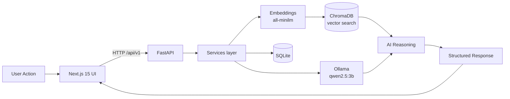

# 🧠 LocalMind AI — On-Device AI Hackathon Pitch

> **A privacy-first, fully offline AI workspace. Not a chatbot — a whole productivity surface where every inference runs locally via Ollama.**

---

## 1. The Problem

Knowledge workers increasingly rely on AI to summarize documents, draft emails, transcribe meetings, and answer questions across their files. But today's tools share a fatal flaw:

- **Your data leaves your device.** Documents, recordings, and notes are uploaded to third-party clouds.
- **You need API keys and a subscription.** There's a paywall and a login between you and productivity.
- **No network, no AI.** On a plane, in a SCIF, in a hospital, or in a country with data-residency laws — cloud AI simply stops working.
- **Compliance nightmares.** Legal, medical, and financial teams often *cannot* send data to OpenAI/Anthropic/Google.

For anyone handling sensitive information, cloud AI is a non-starter.

## 2. The Solution

**LocalMind AI** is a premium desktop-style AI workspace where **100% of AI runs on-device** through [Ollama](https://ollama.com). It delivers a rich, multi-module experience:

- Document intelligence (upload → extract → index → summarize/Q&A/compare)
- AI workspace text transforms (rewrite, translate, report, minutes, tables…)
- Image analysis (OCR, describe, caption, chart reading)
- Voice transcription + command intent
- A semantic knowledge base with cited RAG answers
- Unified ⌘K smart search
- Local automation tasks
- Multi-format exports (PDF/DOCX/MD/TXT/JSON/CSV)

No cloud. No keys. No telemetry. Unplug the network and it all still works.

## 3. Why On-Device Matters

| Cloud AI | LocalMind AI |
| --- | --- |
| Data uploaded to third parties | Data never leaves the device |
| Requires API keys + billing | Zero keys, zero cost per token |
| Breaks without internet | Fully functional offline |
| Compliance risk (GDPR, HIPAA, data residency) | Compliant by construction |
| Vendor lock-in | Swap models freely via Ollama |

On-device AI is the only architecture that satisfies **privacy, cost, availability, and compliance simultaneously.**

## 4. Architecture

- **Frontend:** Next.js 15, TypeScript strict, Tailwind, framer-motion, zustand.
- **Backend:** FastAPI clean architecture (routes → services → repositories, DI).
- **Storage:** SQLite (metadata), ChromaDB (vectors), filesystem (uploads/exports).
- **AI engine:** Ollama HTTP API for `/api/generate`, `/api/chat`, `/api/embeddings`.
- **Resilience:** Every service degrades gracefully when Ollama is offline; heavy deps are lazily imported.

See [docs/ARCHITECTURE.md](docs/ARCHITECTURE.md) for the full breakdown.

## 5. Demo Flow (3 minutes)

1. **Open the Dashboard** — show live CPU/memory/disk + the green Ollama status pill (proof it's local).
2. **Upload a PDF** in Document Intelligence — watch it extract + auto-index, then generate an executive summary.
3. **Ask the Knowledge Base** a question — get an answer with cited sources pulled from the vector store.
4. **AI Workspace** — paste rough notes, click "Meeting Minutes" → polished minutes appear.
5. **Pull the network cable** (or toggle airplane mode) and repeat step 4 — *it still works.* This is the money shot.
6. **Export** the result to PDF locally.

Full script: [docs/DEMO_SCRIPT.md](docs/DEMO_SCRIPT.md).

## 6. Differentiation

- **Not a chatbot** — a complete, opinionated workspace with 10 purpose-built modules.
- **Genuinely offline** — no fallback cloud call hiding in the code.
- **Premium UX** — glassmorphism, motion, command palette; feels like a shipped product, not a hack.
- **Real clean architecture** — not a single-file script; routes/services/repositories with DI and typed contracts.
- **Graceful degradation** — the app boots and stays friendly even if Ollama or optional deps are missing.

## 7. Roadmap

- Streaming token-by-token responses in the UI
- Local model manager with one-click pulls and quantization picker
- Multi-modal vision models (llava) for richer image reasoning
- Encrypted-at-rest vault for documents
- Plugin system for custom automation tasks
- Mobile companion (fully local via Ollama on desktop over LAN)

See [docs/ROADMAP.md](docs/ROADMAP.md).

---

<b>LocalMind AI</b> — GPT-class productivity that answers only to you.

