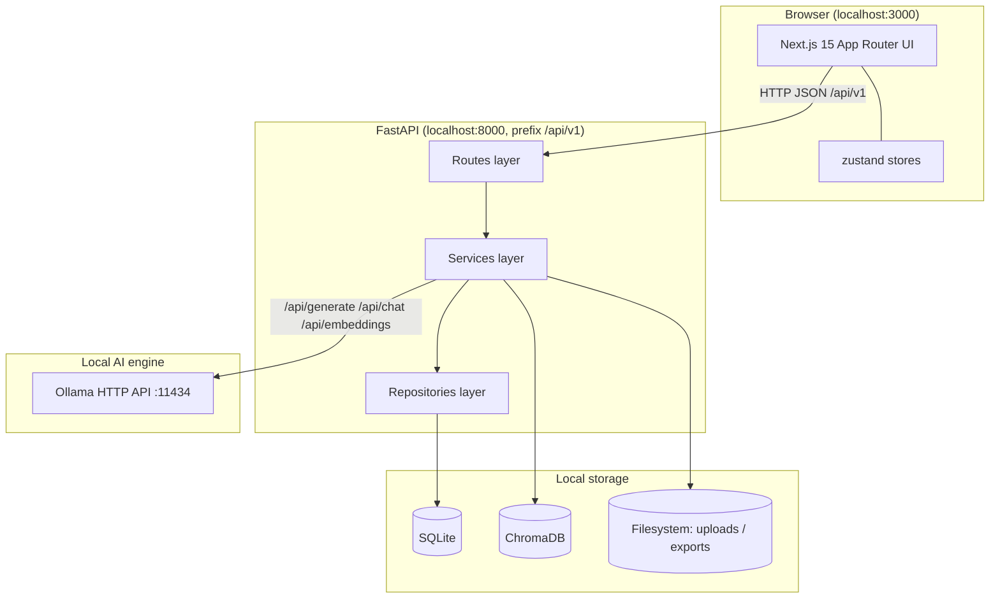
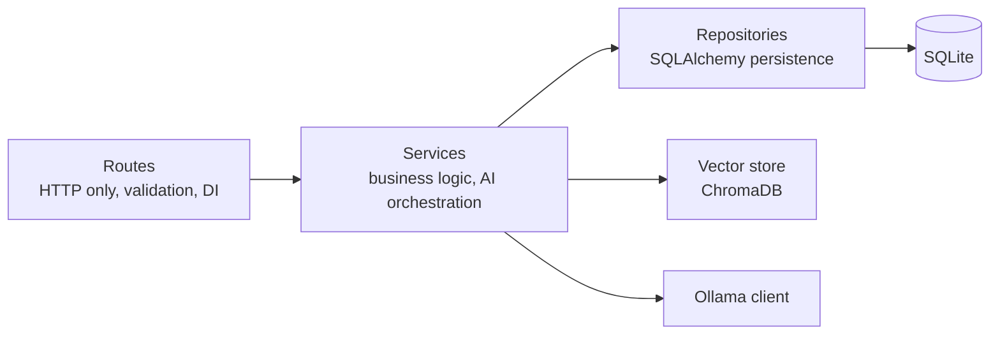
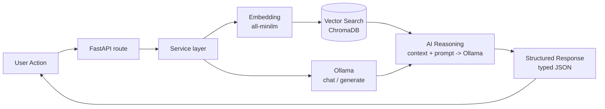
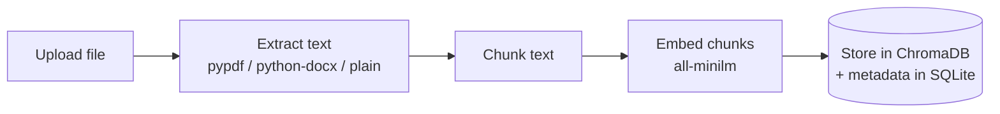

# Architecture

LocalMind AI is a privacy-first, offline AI workspace. Every AI capability runs locally through [Ollama](https://ollama.com). This document explains the system design, the layers, and the AI pipeline.

---

## 1. High-level components

Nothing in this diagram reaches the public internet. Ollama, SQLite, ChromaDB, and the filesystem are all local.

---

## 2. Backend layers (clean architecture)

- **Routes** — thin FastAPI routers. Parse/validate requests (pydantic), inject services via dependency injection, return typed responses. **No business logic.**
- **Services** — all orchestration: prompt construction, Ollama calls, chunking, embedding, vector search, document parsing, export rendering. Every service **degrades gracefully** if Ollama is offline (returns a friendly message, never crashes).
- **Repositories** — SQLAlchemy data access for Documents, Notes, ActionLogs, ExportRecords, Settings, ImageRecords.
- **Config** — `pydantic-settings` reads environment variables (`OLLAMA_HOST`, model names, paths, CORS origin).

### Graceful degradation & lazy imports

Heavy/optional dependencies (`faster-whisper`, `pytesseract`, `pypdf`, `python-docx`, `reportlab`, `sentence-transformers`) are **lazily imported inside methods**, wrapped in `try/except`. If a dependency is missing, the server still boots and the specific feature returns a clear message rather than crashing.

---

## 3. The AI pipeline

This is the canonical request flow for any AI-powered action (document analysis, knowledge ask, workspace transform, automation):

**Step-by-step (RAG example — Knowledge Base "ask"):**

1. **User Action** — user submits a query in the Knowledge Base module.
2. **FastAPI** — `POST /api/v1/knowledge/ask` validates and routes to `KnowledgeService`.
3. **Embedding** — the query is embedded via Ollama `/api/embeddings` using `all-minilm`.
4. **Vector Search** — ChromaDB returns the top-k most similar chunks with sources.
5. **AI Reasoning** — retrieved chunks are assembled into a grounded prompt and sent to Ollama `/api/chat` (`qwen2.5:3b`).
6. **Structured Response** — the service returns `{answer, sources[]}` as typed JSON.
7. The UI renders the answer with cited sources.

**Document indexing flow (write path):**

---

## 4. Data model

| Store | Purpose |
| --- | --- |
| **SQLite** (SQLAlchemy) | Structured metadata: documents, notes, action logs, export records, settings, image records. |
| **ChromaDB** | Vector embeddings of document chunks for semantic search / RAG. |
| **Filesystem** | Raw uploaded files (`uploads/`) and generated exports (`exports/`). |

See [DATABASE_SCHEMA.md](DATABASE_SCHEMA.md) for full table definitions.

---

## 5. Frontend architecture

- **App Router** with a shared `AppShell` (Sidebar + Topbar + main) mounted in `app/layout.tsx`.
- **State:** `useAppStore` (UI: sidebar, command palette, recent actions) and `useSettingsStore` (persisted settings in `localStorage`).
- **API layer:** `@/lib/api` — a typed, resilient `fetch` wrapper that surfaces a friendly error when the backend is offline. Throws on non-OK responses.
- **Types:** `@/lib/types` mirrors every backend response exactly.
- **UI kit:** self-contained shadcn-inspired components (no Radix), styled with Tailwind + CSS variables, animated with framer-motion.

---

## 6. Ollama integration

All inference goes through the Ollama HTTP API at `OLLAMA_HOST` (default `http://localhost:11434`):

| Endpoint | Use |
| --- | --- |
| `POST /api/generate` | Single-prompt generation (supports streaming) |
| `POST /api/chat` | Multi-turn chat (supports streaming) |
| `POST /api/embeddings` | Vector embeddings for indexing/search |
| `GET /api/tags` | List locally available models |

Defaults: chat/reasoning = `qwen2.5:3b`, embeddings = `all-minilm`.

---

## 7. Why this design

- **Privacy:** no data leaves the machine; there is no cloud dependency anywhere in the pipeline.
- **Resilience:** graceful degradation keeps the app usable even when Ollama or optional deps are unavailable.
- **Portability:** swap models freely via Ollama; SQLite + ChromaDB need no external services.
- **Maintainability:** clean layering keeps HTTP, logic, and persistence independently testable.
