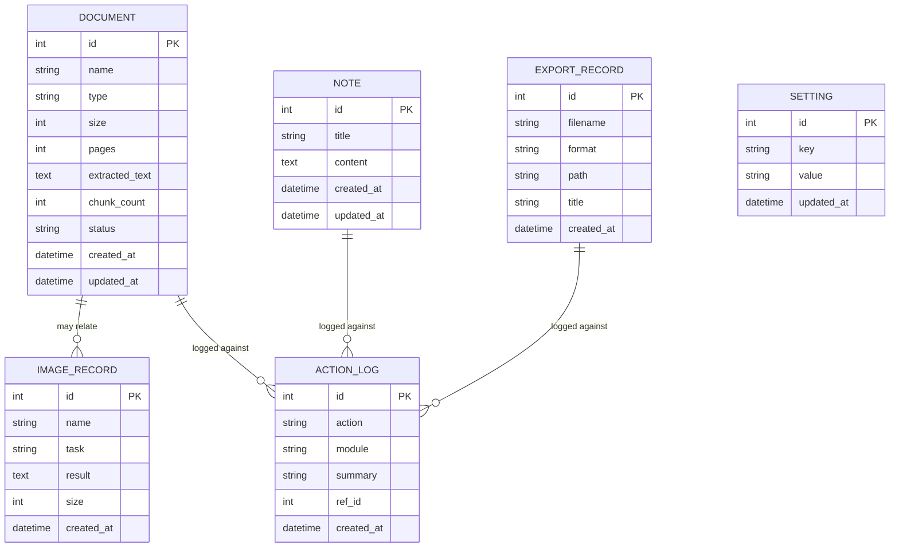

# Database Schema

LocalMind AI stores structured metadata in **SQLite** (via SQLAlchemy) and vector embeddings in **ChromaDB**. Raw files live on the filesystem. This document describes the relational schema.

- **Engine:** SQLite (`DATABASE_URL`, default `sqlite:///./database/localmind.db`)
- **ORM:** SQLAlchemy
- **Vectors:** ChromaDB (separate persistent store in `CHROMA_DIR`)

---

## Entity relationship overview

---

## Tables

### `documents`
Uploaded documents and their extracted text.

| Column | Type | Notes |
| --- | --- | --- |
| `id` | INTEGER | PK, autoincrement |
| `name` | TEXT | Original filename |
| `type` | TEXT | File type (`pdf`, `docx`, `txt`, …) |
| `size` | INTEGER | Bytes |
| `pages` | INTEGER | Nullable (PDFs) |
| `extracted_text` | TEXT | Full extracted text |
| `chunk_count` | INTEGER | Number of chunks indexed in ChromaDB |
| `status` | TEXT | `indexed` / `pending` / `failed` |
| `created_at` | DATETIME | UTC |
| `updated_at` | DATETIME | UTC |

Maps to API: `DocumentItem` (list) and `DocumentDetail` (with `extracted_text`).

### `notes`
Workspace notes.

| Column | Type | Notes |
| --- | --- | --- |
| `id` | INTEGER | PK |
| `title` | TEXT | Note title |
| `content` | TEXT | Note body |
| `created_at` | DATETIME | UTC |
| `updated_at` | DATETIME | UTC |

Maps to API: `Note`.

### `action_logs`
Audit trail of AI actions; powers "recent actions" on the dashboard.

| Column | Type | Notes |
| --- | --- | --- |
| `id` | INTEGER | PK |
| `action` | TEXT | e.g. `summarize`, `analyze`, `export` |
| `module` | TEXT | e.g. `workspace`, `documents`, `knowledge` |
| `summary` | TEXT | Short human-readable description |
| `ref_id` | INTEGER | Nullable — related document/note/export id |
| `created_at` | DATETIME | UTC |

Maps to API: `RecentAction`.

### `export_records`
Generated export files.

| Column | Type | Notes |
| --- | --- | --- |
| `id` | INTEGER | PK |
| `filename` | TEXT | Output filename |
| `format` | TEXT | `pdf`/`docx`/`md`/`txt`/`json`/`csv` |
| `path` | TEXT | Filesystem path under `EXPORT_DIR` |
| `title` | TEXT | Nullable display title |
| `created_at` | DATETIME | UTC |

Maps to API: `ExportItem` (with `download_url` derived as `/api/v1/exports/{id}/download`).

### `settings`
Key/value application settings (single logical settings object).

| Column | Type | Notes |
| --- | --- | --- |
| `id` | INTEGER | PK |
| `key` | TEXT | Setting key (unique) |
| `value` | TEXT | Serialized value |
| `updated_at` | DATETIME | UTC |

Logical keys: `model`, `temperature`, `top_p`, `max_tokens`, `embedding_model`, `ocr_engine`, `speech_engine`, `theme`, `language`. Maps to API: `Settings`.

Defaults: `model=qwen2.5:3b`, `temperature=0.7`, `top_p=0.9`, `max_tokens=2048`, `embedding_model=all-minilm`, `ocr_engine=tesseract`, `speech_engine=whisper`, `theme=dark`, `language=en`.

### `image_records`
Results of image analysis operations.

| Column | Type | Notes |
| --- | --- | --- |
| `id` | INTEGER | PK |
| `name` | TEXT | Original filename |
| `task` | TEXT | `ocr`/`describe`/`caption`/`explain`/`chart`/`screenshot` |
| `result` | TEXT | Extracted text / description / caption |
| `size` | INTEGER | Bytes |
| `created_at` | DATETIME | UTC |

---

## ChromaDB (vectors — not in SQLite)

- One collection of document chunks.
- Each vector's metadata includes `document_id`, `source` (document name), and the chunk `text`.
- Embeddings produced by Ollama `all-minilm` via `/api/embeddings`.
- Used by `/api/v1/knowledge/search` and `/api/v1/knowledge/ask`.

---

## Notes on integrity

- Deleting a `document` also removes its chunks from ChromaDB and its file under `UPLOAD_DIR`.
- `action_logs.ref_id` is a soft reference (not a hard FK) so logs survive deletion of the referenced row.
- All timestamps are stored in UTC (ISO 8601 in API responses).
